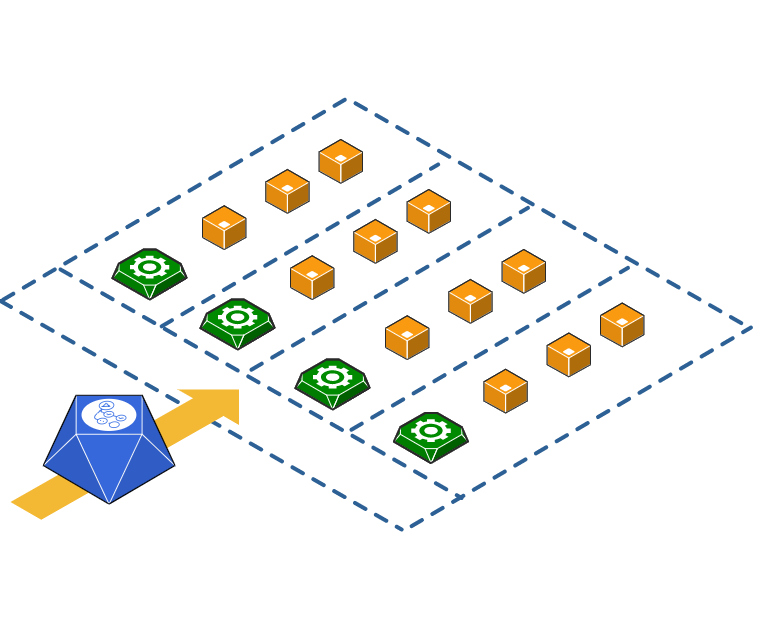

# Github Actions Strategy Matrix Examples
mike

> Provides examples on different ways to use strategy matrix in github actions

[](https://www.youtube.com/watch?v=z_fjpPbaAgw)

> Click To Watch ☝️ - The Matrix of Github Actions



## Workflow Examples
```
.github
└── workflows
    ├── sample-matrix-do-not-exit-early.yml
    ├── sample-matrix-exit-early.yml
    ├── sample-matrix-max-parallel.yml
    ├── sample-matrix-use-includes-json-syntax.yml
    ├── sample-matrix-use-includes-syntax.yml
    └── sample-matrix.yml
```


- sample-matrix.yml
    - Shows simple matrix usage by providing fixed values
    
        

- sample-matrix-max-parallel
    - Shows how to add max number of parallel jobs in the matrix to allow running at the same time
    
        
    
- sample-matrix-exit-early
    - Shows how if one job fails within the matrix the whole matrix of jobs will fail
    
        

- sample-matrix-do-not-exit-early
    - Shows how to let the strategy know not to exit the matrix if one of the jobs withing the matrix fails
    
        

- sample-matrix-use-include-syntax
    - Shows include syntax in yaml format
    
        

- sample-matrix-use-include-json-syntax
    - Shows include syntax in json format
    
        
